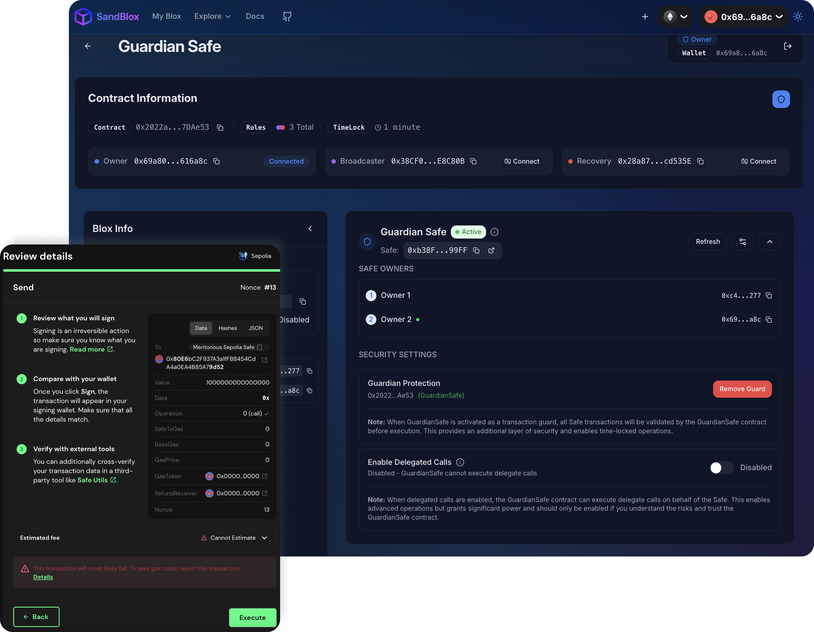
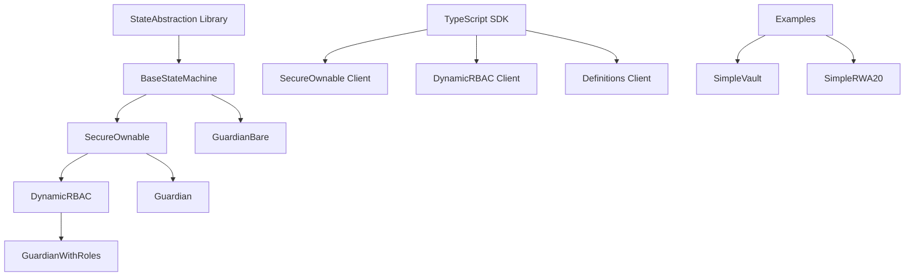

# Bloxchain Protocol: State Abstraction for Blockchain Security

[](https://opensource.org/licenses/MPL-2.0)
[](https://soliditylang.org/)
[](./sdk/typescript/)
[](https://trufflesuite.com/)
[](https://sepolia.etherscan.io/)
[](https://particlecs.com/)

> **⚠️ EXPERIMENTAL SOFTWARE WARNING**  
> This repository contains experimental smart contract code. While the framework is feature-complete and tested, it is not yet audited for production use. Use at your own risk and do not deploy with real assets without proper security review.

## 🚀 What is Bloxchain Protocol?

Bloxchain Protocol is a **revolutionary blockchain security architecture** that eliminates single-point failures through **mandatory multi-signature workflows** and **atomic transaction breakdown**. Unlike traditional smart contracts that execute immediately, Bloxchain implements **time-locked operations** and **meta-transactions** with **role separation** to provide enterprise-grade security.

### 🎯 Core Innovation: State Abstraction

**State Abstraction** breaks traditional atomic blockchain transactions into **multi-phase workflows** where:

- **Smart contracts control storage access** (not individual wallets)
- **Every transaction requires minimum 2 signatures** from different roles
- **Time-locked operations** provide intervention windows
- **Meta-transactions** enable gasless, delegated execution
- **Dynamic role-based access control** adapts without code changes


*[SandBlox](https://sandblox.app/) Transactions - Main interface showing contract operations*

## 🏗️ Architecture Overview

### Core Components



### 🔧 Guardian Implementations

| Contract | Features | Use Case |
|----------|----------|----------|
| **Guardian** | Basic SecureOwnable functionality | Simple ownership management |
| **GuardianBare** | Minimal BaseStateMachine only | Core state machine operations |
| **GuardianWithRoles** | Full DynamicRBAC capabilities | Enterprise role management |

### 🛡️ Security Model

**Mandatory Multi-Signature Architecture:**
- **Time-Delay Workflow**: Request → Wait → Approve (2 signatures)
- **Meta-Transaction Workflow**: Sign → Execute (2 signatures, role separation)
- **No Single-Point Failures**: Contract controls storage, not wallets
- **Temporal Security**: Time-locks provide intervention windows

**Core System Roles**:
- **Owner Role**: Administrative control, can approve operations after timelock, or by signing a Meta-transaction
- **Broadcaster Role**: Meta-transaction execution, gas sponsorship
- **Recovery Role**: Emergency operations, limited scope

## 🚀 Quick Start

### Prerequisites

```bash
# Install Truffle globally
npm install -g truffle

# Install Ganache for local development
# Download from: https://trufflesuite.com/ganache/
```

### Installation

```bash
# Clone the repository
git clone https://github.com/PracticalParticle/Bloxchain-Protocol.git
cd Bloxchain-Protocol

# Install dependencies
npm install

# Start local blockchain
ganache --deterministic --networkId 1337

# Compile contracts
npm run compile:truffle

# Deploy contracts
npm run deploy:truffle
```

### 🌐 Testnet Deployment

**Sepolia Testnet Support**:
```bash
# Deploy to Sepolia testnet
npm run deploy:truffle:sepolia

# Or use SandBlox for interactive testing
# Visit: https://sandblox.app/
```

**Supported Networks**:
- **Local Development**: Ganache (networkId: 1337)
- **Ethereum Sepolia**: Testnet deployment and testing
- **SandBlox Platform**: Interactive testing environment

### TypeScript SDK

```bash
# Install Viem (required dependency)
npm install viem

# Import BloxChain SDK
import { 
  SecureOwnable, 
  DynamicRBAC,
  Definitions,
  type Address,
  type PublicClient,
  type WalletClient 
} from './sdk/typescript';
```

## 📖 Usage Examples

### Basic Ownership Management

```typescript
// Initialize SecureOwnable client
const secureOwnable = new SecureOwnable(
  publicClient,
  walletClient,
  contractAddress,
  chain
);

// Request ownership transfer (time-locked)
const txResult = await secureOwnable.transferOwnershipRequest({
  from: ownerAddress
});

// Approve after time-lock period
const approvalResult = await secureOwnable.transferOwnershipDelayedApproval(
  txId,
  { from: ownerAddress }
);
```

### Meta-Transactions (Gasless)

```typescript
// Create meta-transaction parameters
const metaTxParams = await secureOwnable.createMetaTxParams(
  contractAddress,
  '0x12345678', // function selector
  BigInt(24), // deadline in hours
  BigInt('50000000000'), // max gas price
  signer
);

// Generate unsigned meta-transaction
const metaTx = await secureOwnable.generateUnsignedMetaTransactionForExisting(
  txId,
  metaTxParams
);

// Sign the meta-transaction (client-side)
const signature = await walletClient.signMessage({
  message: { raw: metaTx.message as Uint8Array },
  account: signer
});

// Execute with meta-transaction
await secureOwnable.transferOwnershipApprovalWithMetaTx(
  { ...metaTx, signature },
  { from: broadcasterAddress }
);
```

### Dynamic Role-Based Access Control

```typescript
// Initialize DynamicRBAC client
const dynamicRBAC = new DynamicRBAC(
  publicClient,
  walletClient,
  contractAddress,
  chain
);

// Create custom role
await dynamicRBAC.createRole(
  "TreasuryManager",
  5, // max wallets
  { from: ownerAddress }
);

// Add wallet to role
await dynamicRBAC.addWalletToRole(
  roleHash,
  treasuryWallet,
  { from: ownerAddress }
);

// Grant function permissions
await dynamicRBAC.grantFunctionPermission(
  roleHash,
  functionSelector,
  [TxAction.EXECUTE_TIME_DELAY_REQUEST],
  { from: ownerAddress }
);
```

## 🏭 Real-World Examples

### SimpleVault: Secure Asset Management

**Time-Locked Withdrawal System**:
```solidity
contract SimpleVault is SecureOwnable {
    // Time-locked ETH withdrawal request
    function withdrawEthRequest(address to, uint256 amount) public onlyOwner returns (StateAbstraction.TxRecord memory) {
        // Creates time-locked withdrawal request
        // Requires approval after time-lock period
    }
    
    // Standard approval workflow (after time delay)
    function approveWithdrawalAfterDelay(uint256 txId) public onlyOwner returns (StateAbstraction.TxRecord memory) {
        // Approves withdrawal after mandatory time-lock period
        // Requires owner role permission
    }
    
    // Meta-transaction approval workflow (gasless)
    function approveWithdrawalWithMetaTx(StateAbstraction.MetaTransaction memory metaTx) public onlyBroadcaster returns (StateAbstraction.TxRecord memory) {
        // Approves withdrawal using meta-transaction
        // Requires broadcaster role execution with off-chain signature
    }
}
```

### SimpleRWA20: Tokenized Real-World Assets

**Meta-Transaction Token Operations**:
```solidity
contract SimpleRWA20 is ERC20Upgradeable, ERC20BurnableUpgradeable, SecureOwnable {
    // Secure token minting with meta-transactions
    function mintWithMetaTx(MetaTransaction memory metaTx) external {
        // Only broadcaster can execute
        // Requires off-chain signature from authorized role
    }
}
```


## 🔧 Development Tools

### Interactive Testing Platform

**[SandBlox](https://sandblox.app/)** - Comprehensive testing platform for Bloxchain Protocol:
- **Live Contract Interaction** with real-time state monitoring
- **Multi-signature workflow testing** with visual role management
- **Meta-transaction workflow testing** for gasless operation development
- **Time-lock operation management** with automated workflow tracking
- **Sepolia Testnet Support** - Deploy and test on Ethereum Sepolia testnet

### Contract Compilation & Size Monitoring

```bash
# Compile with size checking
npm run compile:truffle:size

# Verify contracts are under 24KB limit
# Output shows contract sizes and optimization status
```

### Testing Infrastructure

```bash
# Run Truffle tests
npm run test:truffle

# Run Hardhat tests
npm run test:hardhat

# Run sanity checks
npm run test:sanity:secure-ownable
npm run test:sanity:simple-vault

# End-to-end testing
npm run test:e2e
```

### Documentation Generation

```bash
# Generate contract documentation
npm run docgen

# Format Solidity code
npm run format
```

## 📚 Comprehensive Documentation

### 🏗️ Architecture & Design
- **[Protocol Architecture](./sdk/typescript/docs/bloxchain-architecture.md)** - Core design principles
- **[State Machine Engine](./sdk/typescript/docs/state-machine-engine.md)** - SecureOperationState engine
- **[Architecture Patterns](./sdk/typescript/docs/architecture-patterns.md)** - Design patterns

### 🚀 Developer Guides
- **[Getting Started](./sdk/typescript/docs/getting-started.md)** - Quick setup guide
- **[API Reference](./sdk/typescript/docs/api-reference.md)** - Complete API docs
- **[SecureOwnable Guide](./sdk/typescript/docs/secure-ownable.md)** - Ownership management
- **[DynamicRBAC Guide](./sdk/typescript/docs/dynamic-rbac.md)** - Role-based access control

### 🔍 Advanced Topics
- **[Best Practices](./sdk/typescript/docs/best-practices.md)** - Development guidelines
- **[Examples](./sdk/typescript/docs/examples-basic.md)** - Code samples
- **[Types & Interfaces](./sdk/typescript/docs/types-interfaces.md)** - Type definitions

## 🛡️ Security Features

### Multi-Phase Security Model

**Time-Delay Workflow:**
```
Request Phase: Role A → Creates time-locked transaction
↓ (Mandatory time delay)
Approval Phase: Role A or B → Reviews and approves
↓
Execution Phase: Contract → Validates and executes
```

**Meta-Transaction Workflow:**
```
Signing Phase: Signer Role → Creates cryptographic approval
↓
Execution Phase: Executor Role → Submits signed transaction
↓
Validation Phase: Contract → Verifies signatures and executes
```

**Function-Level Permissions**:
- **Time-Delay Operations**: Request, approve, and cancel permissions
- **Meta-Transaction Operations**: Sign and execute permissions with role separation
- **Dynamic Role Management**: Create, update, and delete custom roles
- **System Administration**: Owner, broadcaster, and recovery role management

### Cryptographic Security

- **EIP-712 Compliant**: Structured data signing for meta-transactions
- **Per-Signer Nonces**: Replay attack prevention
- **Role Separation**: Mandatory separation between signing and execution
- **Time-Lock Enforcement**: Mathematical guarantees for temporal security

## 🌟 Key Benefits

### For Developers
- **Eliminates Single-Point Failures**: Mandatory multi-signature architecture
- **Gasless Transactions**: Meta-transaction support with role separation
- **Dynamic Security**: Runtime role configuration without upgrades
- **Type Safety**: Comprehensive TypeScript SDK with full type definitions

### For Enterprises
- **Enterprise-Grade Security**: Time-locked operations with intervention windows
- **Regulatory Compliance**: Built-in audit trails and role management
- **Operational Flexibility**: Dynamic role configuration and workflow adaptation
- **Cost Efficiency**: Gasless transactions and optimized contract size

### For Users
- **Enhanced Security**: Multi-layer validation with temporal separation
- **Better UX**: Gasless transactions and delegated execution
- **Recovery Options**: Built-in recovery mechanisms with time-locked access
- **Transparency**: Complete audit trails and event monitoring

## 🔬 Technical Specifications

### Smart Contract Architecture

**Core Library Implementation**:
- **StateAbstraction Library v1.0.0**: Core state machine with mandatory multi-signature workflows
- **BaseStateMachine**: Foundation for all security contracts with meta-transaction support
- **SecureOwnable**: Multi-role security with Owner, Broadcaster, and Recovery roles
- **DynamicRBAC**: Runtime role configuration with function-level permissions

**Contract Hierarchy**:
```solidity
// Core Library
library StateAbstraction {
    struct SecureOperationState {
        bool initialized;
        uint256 txCounter;
        uint256 timeLockPeriodSec;
        mapping(uint256 => TxRecord) txRecords;
        mapping(bytes32 => Role) roles;
        // ... additional state management
    }
}

// Base State Machine
abstract contract BaseStateMachine is Initializable, ERC165Upgradeable {
    StateAbstraction.SecureOperationState internal _secureState;
    // Meta-transaction utilities and state queries
}

// Security Extensions
abstract contract SecureOwnable is BaseStateMachine, ISecureOwnable {
    // Multi-role security with time-locked operations
}

abstract contract DynamicRBAC is SecureOwnable {
    // Dynamic role-based access control
}
```

**Technical Features**:
- **Solidity Version**: ^0.8.25
- **OpenZeppelin**: ^5.4.0 (with upgradeable contracts)
- **Contract Size**: < 24KB (optimized for mainnet deployment)
- **Gas Optimization**: Library-based architecture with modular definitions
- **EIP-712 Compliance**: Structured data signing for meta-transactions
- **Role Separation**: Mandatory separation between signing and execution roles

### TypeScript SDK
- **Viem Integration**: Modern Ethereum development with type safety
- **Comprehensive Interfaces**: Full contract interaction capabilities
- **Meta-Transaction Utilities**: Complete meta-transaction generation and signing
- **Event Monitoring**: Real-time event parsing and monitoring

### Testing & Quality
- **Truffle Testing**: Comprehensive test suite with Ganache integration
- **Hardhat Support**: Alternative testing framework support
- **Sanity Checks**: Production-ready validation scripts
- **Contract Size Monitoring**: Automated size optimization verification

## 🚧 Implementation Status

### ✅ Available Features
**Core Components**:
- ✅ **StateAbstraction Library v1.0.0**: Centralized state management with multi-phase workflows
- ✅ **Guardian Contracts**: Basic, Bare, and WithRoles implementations
- ✅ **TypeScript SDK**: Full client library with comprehensive documentation
- ✅ **Example Contracts**: SimpleVault and SimpleRWA20 and GuardianSafe with real-world use cases
- ✅ **Comprehensive Tests**: Full suite ensuring functionality and security
- ✅ **Sepolia Testnet Support**: Live deployment and testing on Ethereum Sepolia testnet

**Security Features**:
- ✅ **Mandatory Multi-Signature**: Every transaction requires minimum 2 signatures
- ✅ **Role Separation**: Meta-transactions enforce signer ≠ executor separation
- ✅ **Time-Lock Operations**: Configurable delays with intervention windows
- ✅ **Dynamic RBAC**: Runtime role configuration without contract upgrades
- ✅ **Audit Trails**: Complete transaction history with cryptographic proofs

## 🔮 Roadmap

### Planned

- **Formal Verification** – Automated verification of security and correctness properties
- **Security Audit** – Third-party security audit by leading blockchain security firms


## 🤝 Contributing

We welcome contributions to the Bloxchain Protocol! Please see our comprehensive [Contributing Guidelines](CONTRIBUTING.md) for detailed information on:

- **Development Setup** - Complete environment configuration
- **Code Standards** - Solidity and TypeScript guidelines
- **Testing Requirements** - 100% coverage and comprehensive test suites
- **Security Considerations** - Security review process and best practices
- **Pull Request Process** - Detailed submission and review workflow
- **Applications Development** - Fork-first approach for community applications

**Key Requirements:**
- Follow our [Code of Conduct](CODE_OF_CONDUCT.md)
- Maintain 100% test coverage
- Keep contracts under 24KB size limit
- Use `npm run format` for Solidity formatting
- Include comprehensive documentation updates

### Development Workflow

**Setup & Testing**:
```bash
# Install dependencies and start local blockchain
npm install
ganache --deterministic --networkId 1337

# Compile contracts with size monitoring
npm run compile:truffle:size

# Run comprehensive test suite
npm run test:truffle
npm run test:hardhat

# Run sanity checks
npm run test:sanity:secure-ownable
npm run test:sanity:simple-vault
npm run test:sanity:simple-rwa20
```

**Documentation & Deployment**:
```bash
# Generate documentation and format code
npm run docgen
npm run format

# Deploy to local network
npm run deploy:truffle

```

## 📄 License

This project is licensed under the **Mozilla Public License 2.0 (MPL-2.0)** - see the [LICENSE](LICENSE) file for details.

### Core Framework License
**Key Benefits of MPL-2.0:**
- **Open Source**: Free to use, modify, and distribute
- **Commercial Use**: Clear commercial use permissions
- **Patent Protection**: Protects contributors from patent litigation
- **No Vendor Lock-in**: Freedom to modify without proprietary restrictions

### Applications Directory License Structure

**Important**: The `applications/` directory is **EXCLUDED** from MPL-2.0 licensing:

- **Core Framework**: Licensed under MPL-2.0 (contracts, SDK, documentation)
- **Applications**: Each application has its own separate license
- **Community Applications** (`applications/community/`): Various open-source licenses (MIT, Apache 2.0, GPL v3, etc.)
- **Proprietary Applications** (`applications/proprietary/`): Commercial/proprietary licenses

**Applications are:**
- ❌ **NOT covered by MPL-2.0**
- ❌ **NOT officially supported** by Bloxchain Protocol
- ❌ **NOT part of the core framework**
- ✅ **Licensed separately** with their own terms
- ✅ **Used at your own risk**

See individual LICENSE files in each application directory for specific terms.

## 🙏 Acknowledgments

- **[Particle Crypto Security](https://particlecs.com/)** for the innovative State Abstraction implementation
- **OpenZeppelin** for secure smart contract components and upgradeable patterns
- **Viem** for modern TypeScript blockchain interactions
- **Truffle Suite** for comprehensive development and testing tools

## 📞 Support & Community

- **Documentation**: Comprehensive guides in [`sdk/typescript/docs/`](./sdk/typescript/docs/)
- **Examples**: Real-world implementations in [`contracts/examples/`](./contracts/examples/)
- **Testing Platform**: Interactive development with [SandBlox](https://sandblox.app/)
- **Company Website**: Learn more at [Particle CS](https://particlecs.com/)
- **Issues**: Report bugs and request features via GitHub Issues
- **Discussions**: Join community discussions for questions and collaboration

---

Created by [Particle Crypto Security](https://particlecs.com/)  
Copyright © 2025 Particle Crypto Security. All rights reserved.