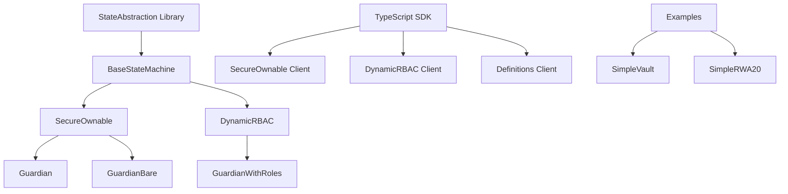

# Bloxchain Protocol: State Abstraction for Blockchain Security

[](https://opensource.org/licenses/MPL-2.0)
[](https://soliditylang.org/)
[](./sdk/typescript/)

> **⚠️ EXPERIMENTAL SOFTWARE WARNING**  
> This repository contains experimental smart contract code. While the framework is feature-complete and tested, it is not yet audited for production use. Use at your own risk and do not deploy with real assets without proper security review.

## 🚀 What is Bloxchain Protocol?

Bloxchain Protocol is a **revolutionary blockchain security architecture** that eliminates single-point failures through **mandatory multi-signature workflows** and **atomic transaction breakdown**. Unlike traditional smart contracts that execute immediately, Bloxchain implements **time-locked operations** and **meta-transactions** with **role separation** to provide enterprise-grade security.

### 🎯 Core Innovation: State Abstraction

**State Abstraction** breaks traditional atomic blockchain transactions into **multi-phase workflows** where:

- **Smart contracts control storage access** (not individual wallets)
- **Every transaction requires minimum 2 signatures** from different roles
- **Time-locked operations** provide intervention windows
- **Meta-transactions** enable gasless, delegated execution
- **Dynamic role-based access control** adapts without code changes

## 🏗️ Architecture Overview

### Core Components



### 🔧 Three Guardian Implementations

| Contract | Features | Use Case |
|----------|----------|----------|
| **Guardian** | Basic SecureOwnable functionality | Simple ownership management |
| **GuardianBare** | Minimal BaseStateMachine only | Core state machine operations |
| **GuardianWithRoles** | Full DynamicRBAC capabilities | Enterprise role management |

### 🛡️ Security Model

**Mandatory Multi-Signature Architecture:**
- **Time-Delay Workflow**: Request → Wait → Approve (2 signatures)
- **Meta-Transaction Workflow**: Sign → Execute (2 signatures, role separation)
- **No Single-Point Failures**: Contract controls storage, not wallets
- **Temporal Security**: Time-locks provide intervention windows

## 🚀 Quick Start

### Prerequisites

```bash
# Install Truffle globally
npm install -g truffle

# Install Ganache for local development
# Download from: https://trufflesuite.com/ganache/
```

### Installation

```bash
# Clone the repository
git clone https://github.com/PracticalParticle/Guardian.git
cd Guardian

# Install dependencies
npm install

# Start local blockchain
ganache --deterministic --networkId 1337

# Compile contracts
npm run compile:truffle

# Deploy contracts
npm run deploy:truffle
```

### TypeScript SDK

```bash
# Install Viem (required dependency)
npm install viem

# Import Guardian SDK
import { 
  SecureOwnable, 
  DynamicRBAC,
  Definitions,
  type Address,
  type PublicClient,
  type WalletClient 
} from './sdk/typescript';
```

## 📖 Usage Examples

### Basic Ownership Management

```typescript
// Initialize SecureOwnable client
const secureOwnable = new SecureOwnable(
  publicClient,
  walletClient,
  contractAddress,
  chain
);

// Request ownership transfer (time-locked)
const txResult = await secureOwnable.transferOwnershipRequest({
  from: ownerAddress
});

// Approve after time-lock period
const approvalResult = await secureOwnable.transferOwnershipDelayedApproval(
  txId,
  { from: ownerAddress }
);
```

### Meta-Transactions (Gasless)

```typescript
// Create meta-transaction parameters
const metaTxParams = await secureOwnable.createMetaTxParams(
  contractAddress,
  '0x12345678', // function selector
  BigInt(24), // deadline in hours
  BigInt('50000000000'), // max gas price
  signer
);

// Generate unsigned meta-transaction
const metaTx = await secureOwnable.generateUnsignedMetaTransactionForExisting(
  txId,
  metaTxParams
);

// Sign the meta-transaction (client-side)
const signature = await walletClient.signMessage({
  message: { raw: metaTx.message as Uint8Array },
  account: signer
});

// Execute with meta-transaction
await secureOwnable.transferOwnershipApprovalWithMetaTx(
  { ...metaTx, signature },
  { from: broadcasterAddress }
);
```

### Dynamic Role-Based Access Control

```typescript
// Initialize DynamicRBAC client
const dynamicRBAC = new DynamicRBAC(
  publicClient,
  walletClient,
  contractAddress,
  chain
);

// Create custom role
await dynamicRBAC.createRole(
  "TreasuryManager",
  5, // max wallets
  { from: ownerAddress }
);

// Add wallet to role
await dynamicRBAC.addWalletToRole(
  roleHash,
  treasuryWallet,
  { from: ownerAddress }
);

// Grant function permissions
await dynamicRBAC.grantFunctionPermission(
  roleHash,
  functionSelector,
  [TxAction.EXECUTE_TIME_DELAY_REQUEST],
  { from: ownerAddress }
);
```

## 🏭 Real-World Examples

### SimpleVault: Secure Asset Management

```solidity
contract SimpleVault is SecureOwnable {
    // Time-locked ETH withdrawal
    function withdrawEthRequest(address to, uint256 amount) external {
        // Creates time-locked withdrawal request
        // Requires approval after time-lock period
    }
    
    // Meta-transaction token withdrawal
    function withdrawTokenWithMetaTx(MetaTransaction memory metaTx) external {
        // Gasless token withdrawal via meta-transaction
        // Requires role separation (signer + executor)
    }
}
```

### SimpleRWA20: Tokenized Real-World Assets

```solidity
contract SimpleRWA20 is ERC20Upgradeable, SecureOwnable {
    // Secure token minting with meta-transactions
    function mintWithMetaTx(MetaTransaction memory metaTx) external {
        // Only broadcaster can execute
        // Requires off-chain signature from authorized role
    }
    
    // Time-locked token burning
    function burnWithDelay(address from, uint256 amount) external {
        // Creates time-locked burn request
        // Prevents immediate token destruction
    }
}
```

## 🔧 Development Tools

### Contract Compilation & Size Monitoring

```bash
# Compile with size checking
npm run compile:truffle:size

# Verify contracts are under 24KB limit
# Output shows contract sizes and optimization status
```

### Testing Infrastructure

```bash
# Run Truffle tests
npm run test:truffle

# Run Hardhat tests
npm run test:hardhat

# Run sanity checks
npm run test:sanity:secure-ownable
npm run test:sanity:simple-vault

# End-to-end testing
npm run test:e2e
```

### Documentation Generation

```bash
# Generate contract documentation
npm run docgen

# Format Solidity code
npm run format
```

## 📚 Comprehensive Documentation

### 🏗️ Architecture & Design
- **[Protocol Architecture](./sdk/typescript/docs/bloxchain-architecture.md)** - Core design principles
- **[State Machine Engine](./sdk/typescript/docs/state-machine-engine.md)** - SecureOperationState engine
- **[Architecture Patterns](./sdk/typescript/docs/architecture-patterns.md)** - Design patterns

### 🚀 Developer Guides
- **[Getting Started](./sdk/typescript/docs/getting-started.md)** - Quick setup guide
- **[API Reference](./sdk/typescript/docs/api-reference.md)** - Complete API docs
- **[SecureOwnable Guide](./sdk/typescript/docs/secure-ownable.md)** - Ownership management
- **[DynamicRBAC Guide](./sdk/typescript/docs/dynamic-rbac.md)** - Role-based access control

### 🔍 Advanced Topics
- **[Best Practices](./sdk/typescript/docs/best-practices.md)** - Development guidelines
- **[Examples](./sdk/typescript/docs/examples-basic.md)** - Code samples
- **[Types & Interfaces](./sdk/typescript/docs/types-interfaces.md)** - Type definitions

## 🛡️ Security Features

### Multi-Phase Security Model

**Time-Delay Workflow:**
```
Request Phase: Role A → Creates time-locked transaction
↓ (Mandatory time delay)
Approval Phase: Role A or B → Reviews and approves
↓
Execution Phase: Contract → Validates and executes
```

**Meta-Transaction Workflow:**
```
Signing Phase: Signer Role → Creates cryptographic approval
↓
Execution Phase: Executor Role → Submits signed transaction
↓
Validation Phase: Contract → Verifies signatures and executes
```

### Role-Based Access Control

- **Owner Role**: Administrative control, can approve operations after timelock
- **Broadcaster Role**: Meta-transaction execution, gas sponsorship
- **Recovery Role**: Emergency operations, limited scope
- **Dynamic Roles**: Custom roles with function-level permissions

### Cryptographic Security

- **EIP-712 Compliant**: Structured data signing for meta-transactions
- **Per-Signer Nonces**: Replay attack prevention
- **Role Separation**: Mandatory separation between signing and execution
- **Time-Lock Enforcement**: Mathematical guarantees for temporal security

## 🌟 Key Benefits

### For Developers
- **Eliminates Single-Point Failures**: Mandatory multi-signature architecture
- **Gasless Transactions**: Meta-transaction support with role separation
- **Dynamic Security**: Runtime role configuration without upgrades
- **Type Safety**: Comprehensive TypeScript SDK with full type definitions

### For Enterprises
- **Enterprise-Grade Security**: Time-locked operations with intervention windows
- **Regulatory Compliance**: Built-in audit trails and role management
- **Operational Flexibility**: Dynamic role configuration and workflow adaptation
- **Cost Efficiency**: Gasless transactions and optimized contract size

### For Users
- **Enhanced Security**: Multi-layer validation with temporal separation
- **Better UX**: Gasless transactions and delegated execution
- **Recovery Options**: Built-in recovery mechanisms with time-locked access
- **Transparency**: Complete audit trails and event monitoring

## 🔬 Technical Specifications

### Smart Contract Architecture
- **Solidity Version**: ^0.8.25
- **OpenZeppelin**: ^5.4.0 (with upgradeable contracts)
- **Contract Size**: < 24KB (optimized for mainnet deployment)
- **Gas Optimization**: Library-based architecture with modular definitions

### TypeScript SDK
- **Viem Integration**: Modern Ethereum development with type safety
- **Comprehensive Interfaces**: Full contract interaction capabilities
- **Meta-Transaction Utilities**: Complete meta-transaction generation and signing
- **Event Monitoring**: Real-time event parsing and monitoring

### Testing & Quality
- **Truffle Testing**: Comprehensive test suite with Ganache integration
- **Hardhat Support**: Alternative testing framework support
- **Sanity Checks**: Production-ready validation scripts
- **Contract Size Monitoring**: Automated size optimization verification

## 🚧 Current Status

### ✅ Implemented Features
- **Core StateAbstraction Library**: Complete implementation with all security features
- **Three Guardian Variants**: Guardian, GuardianBare, GuardianWithRoles
- **Complete TypeScript SDK**: Full client library with comprehensive documentation
- **Real Examples**: SimpleVault and SimpleRWA20 production implementations
- **Testing Infrastructure**: Truffle tests, Hardhat support, sanity checks
- **Meta-Transactions**: EIP-712 compliant with role separation
- **Dynamic RBAC**: Runtime role configuration and function-level permissions
- **Time-Lock Operations**: Request/approval workflows with temporal security

### 🔮 Roadmap Features
- **Formal Verification**: Automated security property verification

## 🤝 Contributing

We welcome contributions to the Bloxchain Protocol! Please see our contributing guidelines:

1. **Fork the repository**
2. **Create a feature branch**: `git checkout -b feature/amazing-feature`
3. **Follow our coding standards**: Use `npm run format` for Solidity formatting
4. **Add tests**: Ensure comprehensive test coverage
5. **Submit a pull request**: Include detailed description of changes

### Development Setup

```bash
# Install dependencies
npm install

# Start local blockchain
ganache --deterministic --networkId 1337

# Run tests
npm run test:truffle

# Check contract sizes
npm run compile:truffle:size
```

## 📄 License

This project is licensed under the **Mozilla Public License 2.0 (MPL-2.0)** - see the [LICENSE](LICENSE) file for details.

**Key Benefits of MPL-2.0:**
- **Open Source**: Free to use, modify, and distribute
- **Commercial Use**: Clear commercial use permissions
- **Patent Protection**: Protects contributors from patent litigation
- **No Vendor Lock-in**: Freedom to modify without proprietary restrictions

## 🙏 Acknowledgments

- **Particle Crypto Security** for the innovative State Abstraction implementation
- **OpenZeppelin** for secure smart contract components and upgradeable patterns
- **Viem** for modern TypeScript blockchain interactions
- **Truffle Suite** for comprehensive development and testing tools

## 📞 Support & Community

- **Documentation**: Comprehensive guides in [`sdk/typescript/docs/`](./sdk/typescript/docs/)
- **Examples**: Real-world implementations in [`contracts/examples/`](./contracts/examples/)
- **Issues**: Report bugs and request features via GitHub Issues
- **Discussions**: Join community discussions for questions and collaboration

---

Created by Particle Crypto Security  
Copyright � 2025 Particle Crypto Security. All rights reserved.

